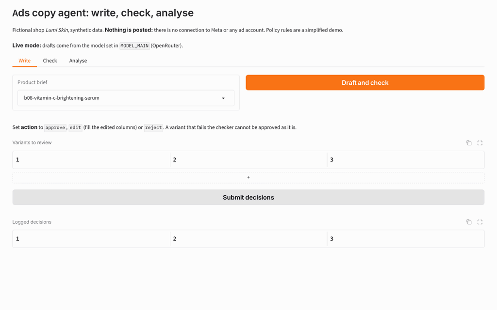
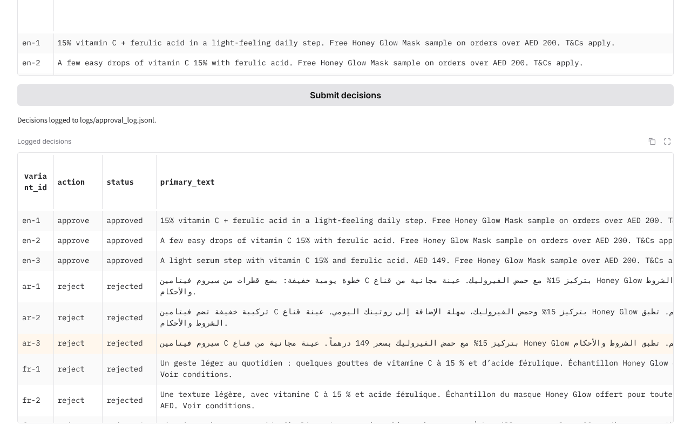
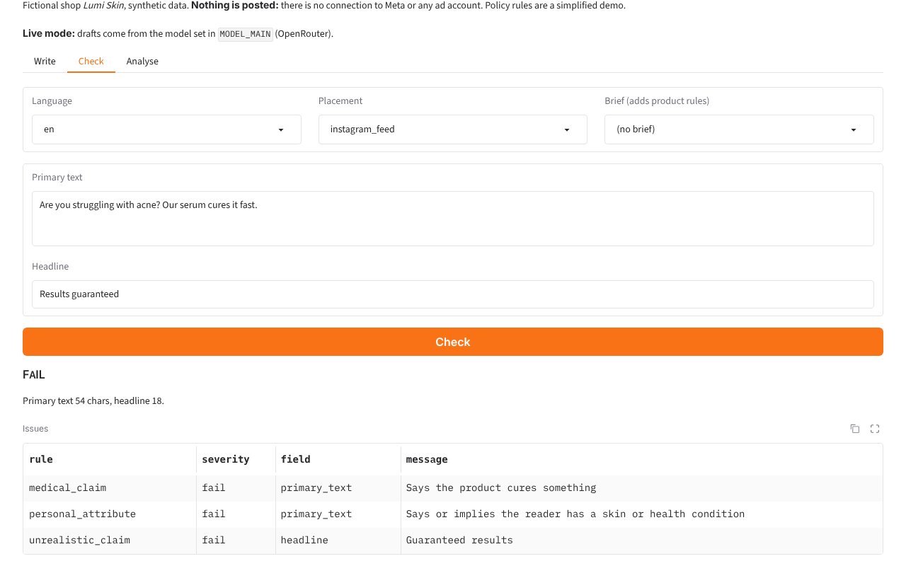
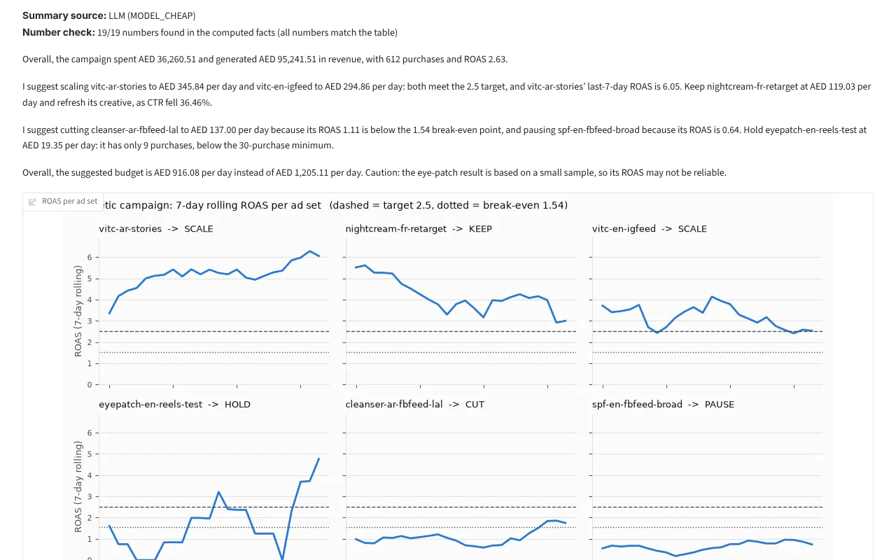
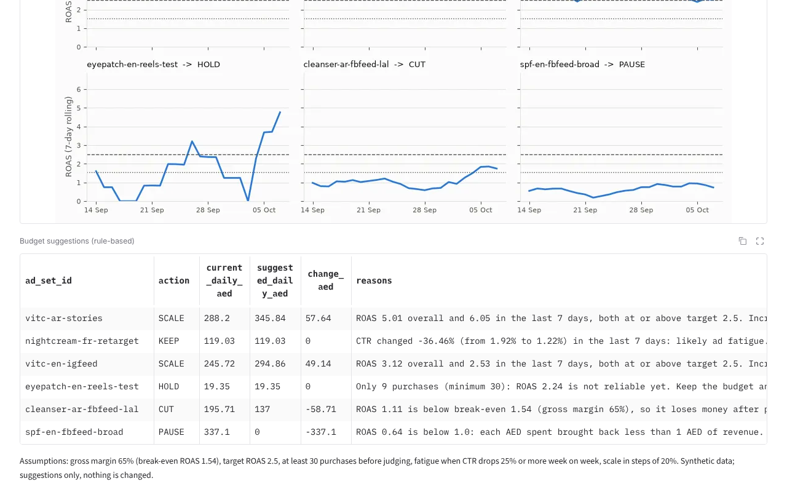
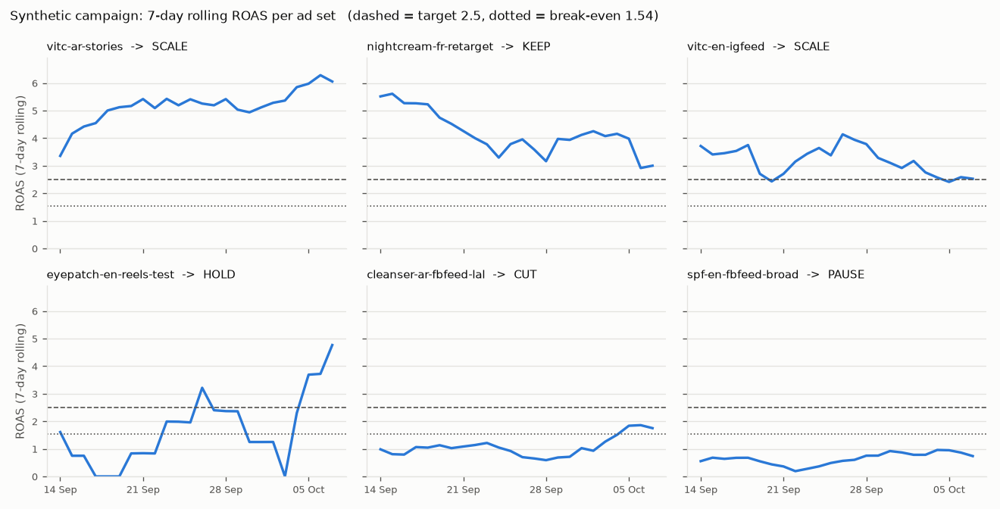
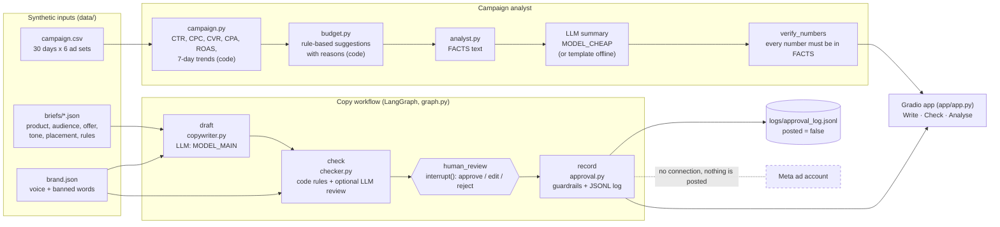

# ads-copy-agent

**Drafts Arabic, English and French ad copy from a product brief, checks it against brand and ad-policy rules, and turns a campaign file into budget suggestions with reasons. A human approves everything, and nothing is ever posted.**

Built for a fictional skincare shop, "Lumi Skin", with synthetic data only. There's no connection to Meta or any ad account.

## Demo

**Live demo:** [huggingface.co/spaces/sarahebbadj/ads-copy-agent](https://huggingface.co/spaces/sarahebbadj/ads-copy-agent) (works without an API key, in demo mode).

To enable live AI on your own copy: add `OPENROUTER_API_KEY` as a Space secret (and `MODEL_MAIN` and `MODEL_CHEAP` as variables).

The Gradio app has three tabs:

- **Write**: pick a brief, draft and check the variants, then approve, edit or reject each one.
- **Check**: paste any ad text and see pass or fail with reasons.
- **Analyse**: metrics, trends, budget suggestions, a chart and a summary whose numbers are checked.

Screenshots from a local run on 8 October 2026 with live AI (`openai/gpt-6-luna` through OpenRouter for both the drafts and the summary). Nothing was posted anywhere.


*Write, Check, Analyse: drafts for a brief, a non-compliant ad flagged, and the campaign analysis.*


*Write tab, vitamin C serum brief: 9 drafts (EN, AR, FR) checked and logged; the 6 Arabic and French drafts were over the 125-character feed limit, so the checker rejected them.*


*Check tab: "Are you struggling with acne? Our serum cures it fast." / "Results guaranteed" fails three rules.*


*Analyse tab: the LLM summary, with every number found in the computed facts, above the 7-day ROAS chart.*


*Rule-based budget suggestions per ad set, with the reasons and the stated assumptions.*



## The problem

A small marketing team running Facebook and Instagram ads in the UAE has to:

- write the same message well in three languages;
- keep it inside the platform's advertising standards and the brand's own rules (no "cures acne", no "Are you struggling with acne?", no whitening language, terms lines on offers);
- decide every week where the budget should go.

An LLM can draft fast, but it can also invent claims and numbers. This project shows a way to get the speed and still keep the checks: the LLM writes and explains, code checks and computes, and a person decides.

## What it does

- **Copy generator.** Writes 3 variants per language (primary text, headline and a call-to-action button) from a JSON brief. The prompt includes the brand voice, the length limits for the placement, the banned words and the required lines.
- **Policy and brand checker.**
  - Layer 1 is code rules in EN, AR and FR: personal attributes, medical claims, unrealistic or guaranteed results, before/after, brand-banned words, missing terms lines or product disclaimers, length per placement, and the CTA type. Style issues are warnings.
  - Layer 2 is an optional LLM review against a written [checklist](docs/policy_checklist.md).
  - Both layers give pass or fail with reasons.
- **Human approval (LangGraph `interrupt`).** The workflow pauses for a person to approve, edit or reject each variant.
  - A variant that fails can't be approved, and edits are checked again.
  - Every decision is logged with `posted: false`.
- **Campaign analyst.** pandas computes CTR, CPC, CVR, CPA and ROAS, plus the last 7 days against the 7 before. Rule-based budget suggestions (SCALE, KEEP, CUT, PAUSE, HOLD) come with their reasons and assumptions, and flag small samples.
- **LLM summary with a number check.** The model only sees the computed FACTS, and every number in its summary is checked against them. Without a key, a template summary is used.
- **Evaluation runner.** One command per evaluation, a `--dry-run` mode, and cost and latency traces for every model call.

## Architecture



**Tools:**

- Python 3.11+, pandas, matplotlib, LangGraph (state, `interrupt`, checkpointer), Gradio, pytest and ruff.
- Models are reached through OpenRouter with the OpenAI-compatible SDK. Model IDs come from `.env`: `MODEL_MAIN`, `MODEL_CHEAP` and `MODEL_JUDGE`.

Component details are in [docs/architecture.md](docs/architecture.md).

## Results

| Run (date, version) | What was measured (denominator) | Result | Evidence | Notes |
|---|---|---|---|---|
| 2026-10-08, v0.1, no LLM | **Policy checker, code rules only, held-out test set**: 48 ad texts (16 EN, 16 AR, 16 FR; 24 violating, 24 compliant) | **Precision 0.94 (16/17), recall 0.67 (16/24)**, accuracy 0.81 (39/48) | `evals/results/policy_rules_summary.json`, `policy_rules_test.csv` | Command: `python -m evals.run --task policy`. Deterministic, no model involved. Rule-file hashes are stored in the summary |
| same | Held-out, by language | EN: P 0.83 (5/6), R 0.63 (5/8) · AR: P 1.00 (6/6), R 0.75 (6/8) · FR: P 1.00 (5/5), R 0.63 (5/8) | same | 16 cases per language, so each case moves recall by 12.5 points |
| same | Development set: 24 texts written together with the rules | 24/24 correct | `policy_rules_dev.csv` | Not evidence of quality: the rules were tuned on this set |
| 2026-10-08, v0.1, live | **Checker with the LLM review layer (rules OR LLM)**, same 48 held-out cases. Reviewer: `openai/gpt-6-luna` (MODEL_CHEAP), temperature 0 | **Precision 0.89 (24/27), recall 1.00 (24/24)**, accuracy 0.94 (45/48). LLM alone: P 0.88 (22/25), R 0.92 (22/24). Code rules alone, same run: P 0.94 (16/17), R 0.67 (16/24) | `evals/results/policy_llm_openai_2026-10-08.csv`, `policy_llm_openai_2026-10-08_summary.json` | Command: `python -m evals.run --task policy-llm --model cheap`. The held-out set went to the model once, after a smoke run on the development set. 0 unreadable answers. Cost US$0.004. Read the limits below: the checklist and the cases have the same author |
| same | Held-out, by language (16 each): code only → code + LLM | EN: P 0.83 (5/6) → 0.80 (8/10), R 0.63 (5/8) → 1.00 (8/8) · AR: P 1.00 (6/6) → 0.89 (8/9), R 0.75 (6/8) → 1.00 (8/8) · FR: P 1.00 (5/5) → 1.00 (8/8), R 0.63 (5/8) → 1.00 (8/8) | same | The LLM layer adds 8 correct catches and 2 false alarms. Its own 2 misses are length violations, which it is told to leave to the code |
| 2026-10-08, v0.1, live | **Copy quality**: 30 briefs × 3 languages × 3 variants = 270 drafts by `openai/gpt-6-luna` (MODEL_CHEAP) | **Rule check pass 262/270 (0.97)**: AR 90/90, EN 88/90, FR 84/90. All 8 failures are length: primary text of 126–131 characters against a 125 limit | `evals/results/copy_openai_2026-10-08.csv` (also Sara's rating sheet), `copy_openai_2026-10-08_summary.json` | Command: `python -m evals.run --task copy --model cheap`. 0 drafts failed to parse. Cost US$0.6056 (drafts and judge v1) |
| same | **LLM-judge scores, not human scores** (1–5), same 270 drafts. Judge: `google/gemini-3.8-flash` (MODEL_JUDGE), a different model family | Judge v2: brand fit **4.19**, language quality **4.85** (AR 4.16 / 4.81 · EN 4.37 / 4.92 · FR 4.06 / 4.81). Judge v1: 3.55 / 4.66. Weakest group: reels briefs with an offer, brand fit 1.85 (27 drafts) | `copy_openai_2026-10-08_judge_v2.csv`, `copy_openai_2026-10-08_judge_v2_summary.json`, `copy_judge_comparison.json` | v1 wasn't shown the offer, the required sentence or the brand voice. v2 was written **after** seeing the v1 scores, so both are reported (see below). Command: `python -m evals.run --task copy-rejudge --source evals/results/copy_openai_2026-10-08.csv`. Cost US$0.5945. Sara's own 1–5 ratings: pending |
| 2026-10-08, v0.1, live | **Analyst number check**: LLM summaries by `openai/gpt-6-luna` (MODEL_CHEAP) for 5 scenarios | **98/98 numbers (100%) appear in the computed FACTS**; 5/5 summaries have no mismatch. A manual read found all 98 attached to the right ad set and metric | `analyst_openai_2026-10-08.csv`, `analyst_openai_2026-10-08_summary.json`, `analyst_openai_2026-10-08_attribution_audit.csv` | Command: `python -m evals.run --task analyst --model cheap`. Cost US$0.0018. The manual read was done by the coding agent, not by a person |

All labelled cases and the checklist were written by a coding agent. The Arabic and French labels still need review by a native speaker: Sara, who is trilingual.

Total OpenRouter spend for the live runs on 8 October 2026, smoke runs and the re-scoring included: **US$1.25 over 692 calls**, all successful. Every call is in `evals/traces.jsonl` with its model, tokens, cost and latency. Smoke-run files are in `evals/results/smoke/` and are not results.

**Example output of the analyst** (deterministic, on the synthetic `campaign.csv`; this is a demo output, not an evaluation):

| Ad set | ROAS | Purchases | Suggestion | Main reason |
|---|---|---|---|---|
| vitc-ar-stories | 5.01 | 233 | SCALE +20% | At or above target 2.5 overall and in the last 7 days |
| nightcream-fr-retarget | 4.08 | 92 | KEEP | CTR fell 36.46% week on week (likely ad fatigue), so refresh the creative first |
| vitc-en-igfeed | 3.12 | 122 | SCALE +20% | Last 7 days 2.53, still at or above target |
| eyepatch-en-reels-test | 2.24 | 9 | HOLD | Only 9 purchases, so the ROAS isn't reliable yet |
| cleanser-ar-fbfeed-lal | 1.11 | 87 | CUT −30% | Below break-even ROAS 1.54 (assumed 65% gross margin) |
| spf-en-fbfeed-broad | 0.64 | 69 | PAUSE | Below 1.0, so it brings back less than it spends |

## What failed and what I changed

**Held-out errors of the code rules (v0.1)**: 9 of 48 cases, all listed in `evals/results/policy_rules_test.csv`.

- **Sensational hooks are missed: 3 cases**, one per language. Example: "Dermatologists don't want you to know this one trick…". No code rule exists for this category. This was a deliberate choice, and it's what the LLM layer is for.
- **Age-reversal and time-span claims are missed: 3 cases**, one per language. Example: "Look 10 years younger in just two weeks". The patterns cover "overnight" and "in 3 days", but not weeks or "younger".
- **A negative self-image with no condition word is missed: 1 case.** "Feeling self-conscious about your skin?" The personal-attribute rule only looks for listed conditions such as acne or wrinkles.
- **A word form is missed: 1 case.** «crème blanchissante». The banned list has «blanchissant», but word-boundary matching misses the feminine form.
- **One false positive.** "This oil-free gel won't clog your pores or cause breakouts." The rule saw "your … breakouts" and flagged a personal attribute, but the sentence describes the product.

The rules were **not** changed after this run, so the number stays honest. The fixes are listed under Next steps, and they need a fresh held-out set to measure.

**First live LLM runs (8 October 2026, run by a coding agent), in the order things happened:**

1. **The LLM reviewer failed every compliant ad (smoke run on the development set).** The checklist asks the reviewer to check the length per placement and the call-to-action button, but `llm_review` only sends the language, primary text and headline. So the model failed all 12 compliant development ads with "no call-to-action button" or "placement missing" (LLM precision 0.50, 12/24).
   - Fix (by the coding agent): a note in `docs/policy_checklist.md` telling the reviewer that code checks items 7 and 8, so it judges the wording against items 1 to 6. The note went in the checklist rather than in `checker.py`, so the frozen rule-file hashes stay valid. A test now guards it.
   - Development re-run: LLM precision 0.86 (12/14), recall 1.00 (12/12). Both development runs are in `evals/results/smoke/`.
2. **Keeping the held-out set clean.** A `--split dev` option makes smoke runs use the development cases. The 48 held-out cases went to the model once, after the fix, and the reviewer prompt wasn't changed after that.
3. **Held-out errors of rules OR LLM: 3 false alarms, 0 misses.**
   - "Satisfaction guaranteed" (EN, compliant): the LLM read it as a guaranteed result, although the checklist says refund promises are fine.
   - "won't clog your pores or cause breakouts" (EN, compliant): the rules' old false positive. The LLM flagged it too, as a health claim.
   - «في عشر دقائق», "in ten minutes" (AR, compliant): the LLM read it as a rapid-result promise.
4. **The copy judge wasn't shown the whole brief (judge v1).** It saw the product, audience, key message and tone, but not the offer, the required sentence or the brand voice. So it marked down lines the brief makes compulsory: a free "Honey Glow" sample offer was read as "promoting a different product". Under v1, mean brand fit was 2.72 on the 108 drafts whose brief has an offer, against 4.10 on the other 162.
   - Fix: judge v2 also sees the offer, the required sentence and the brand voice. It's told not to mark down the mandated lines, but to mark down when they crowd out the key message.
   - **The same 270 drafts** were re-scored with `--task copy-rejudge`. 140 brand-fit scores went up, 130 stayed the same and none went down (`copy_judge_comparison.json`). This change was made after seeing results, so both versions are reported. Language-quality scores also rose (4.66 → 4.85) although that part of the rubric didn't change, which shows how much a judge's scores depend on its prompt.
5. **What judge v2 then found: the writer drops the message when space is short.** All 32 drafts scored 1 or 2 for brand fit come from briefs with an offer. On reels (72-character primary text) with an offer, mean brand fit is 1.85 (27 drafts). For the snail-mucin brief (reels), all 9 primary texts are only the offer and the terms line, such as "Use LUMI15 for 15% off until 31 October 2026. T&Cs apply." For the kids' sunscreen brief (reels), all 9 drafts put the terms line in the headline, no primary text names the sunscreen, and the 3 French headlines name the free sample ("Honey Glow Mask") instead. The rule check passes these, because it reads the headline and primary text together and has no rule for "says what the product is". Not fixed yet (see Next steps).
6. **8 of 270 drafts were too long**: primary text of 126–131 characters against 125. The prompt states the limit, but the model doesn't count characters exactly. The checker caught all 8. Not fixed yet.
7. **Analyst: nothing failed.** 98 of 98 numbers were in the FACTS. All 692 calls returned without an API error.

**Decisions made while building, on the development set, before the held-out run:**

- A bare percentage is no longer treated as an offer, because skincare copy often names ingredient strengths ("vitamin C 15%"). Only discount wording counts.
- The product name is removed before the claim rules run, so "Salicylic Acne Cleanser" isn't read as a claim about acne.
- "Satisfaction guaranteed" is allowed, because it's about refunds, while "guaranteed" results are not.
- The checklist examples were first copied from the test cases. They were rewritten so the LLM reviewer never sees test sentences in its prompt.

> TODO (Sara): list what you changed after reviewing, for example labels you disagreed with in Arabic or French, rules you rewrote, or prompt changes after the first live run.

## How to run

You need [uv](https://docs.astral.sh/uv/) and Python 3.11 or newer.

```bash
git clone <repo-url> ads-copy-agent && cd ads-copy-agent   # repo name pending Sara's confirmation
uv sync --extra app --extra dev                             # creates .venv and installs everything
uv run pytest -q                                            # offline tests (no network, no keys)
uv run python -m evals.run --task policy                    # checker evaluation (no LLM needed)
uv run python app/app.py                                    # demo at http://127.0.0.1:7860
```

**Live LLM runs** need these settings in `Portfolio Projects/.env` (or `repo/.env`): `OPENROUTER_API_KEY`, `MODEL_MAIN`, `MODEL_CHEAP` and `MODEL_JUDGE`. The judge must come from a different model family. Then:

```bash
uv run python -m evals.run --task policy-llm --model cheap --split dev   # smoke run, development set
uv run python -m evals.run --task policy-llm --model cheap               # held-out set: run once
uv run python -m evals.run --task copy --model cheap --limit 1           # smoke run, 1 brief
uv run python -m evals.run --task copy --model cheap                     # 30 briefs, about 1 hour
uv run python -m evals.run --task analyst --model cheap                  # 5 scenarios
```

A run stops if one model client spends more than `MAX_COST_PER_RUN_USD`. The 8 October runs cost US$1.25 in total.

Without a key, `--dry-run` runs the whole pipeline with a fake model and writes to `evals/dry_run/`. These are not results.

## Data and licence

All data is synthetic. See [data/README.md](data/README.md).

- `products.csv` is the shared synthetic Lumi Skin data, generated by `generate.py` (seed 42).
- The briefs and `campaign.csv` are generated by the scripts in `data/`.
- No real company, customer or ad-account data is used.
- The policy checklist paraphrases themes from [Meta's Advertising Standards](https://transparency.meta.com/policies/ad-standards/) in general terms. It's a **simplified demo**, not Meta's review system and not legal advice.

Code and data are under the MIT licence, © 2026 Sara Hebbadj.

## How I used AI agents

> DRAFT for Sara to edit. Keep only what is true.

- **Brief and acceptance tests.** I wrote the brief and the acceptance tests in `BUILD_SPEC.md`. The brief covers the three components, the human approval step, the evaluation sets and the "nothing is posted" rule. It builds on my Meta Business Suite work in skincare e-commerce.
- **First version.** A coding agent (Claude) generated the first version of the code, the synthetic data, the labelled test cases and these docs, following those specs.
  - The development and held-out cases were kept separate, and the rules were frozen before the held-out run.
  - The agent ran the deterministic evaluation and the tests. No LLM was called, because model access wasn't available at build time.
- **First live evaluation.** Later on 8 October, a coding agent ran the live evaluations through OpenRouter (models, cost and results are in the Results table). It fixed the two problems they exposed (the reviewer's scope and the judge's missing brief fields) and logged them above.
- **My review.** I'll review, run and change the code.

> TODO (Sara): describe your review: which files you read line by line, what you ran, which Arabic and French labels you corrected, and what you changed and why.
>
> TODO (Sara): after the first live run, add the model IDs, date, cost and what surprised you.

## Limitations and next steps

**Limitations:**

- The rules are a small, simplified demo. They can't keep up with the real advertising standards, which change, or with every way people phrase a claim.
- 48 held-out cases is a small set. One case moves the per-language recall by 12.5 points.
- The labels and the rules were written by the same agent, and native-speaker review is pending.
- Arabic matching works inside words, so it can over-match (for example, «رخيص» also matches inside «ترخيص»). Lengths count diacritics.
- Budget thresholds (margin, target ROAS, 30-purchase minimum, 20% steps) are assumptions. ROAS here is last-click revenue from a synthetic file, with no attribution windows or incrementality.
- The number check confirms that a number exists in the facts. It can't confirm the number is attached to the right metric. A manual read of the 98 numbers in the 8 October run found none attached to the wrong metric, but that's one run, read by the coding agent.
- The checklist (the LLM reviewer's prompt) and the held-out cases were written by the same coding agent. No test sentence appears in the checklist (a test checks this), but the checklist names the same kinds of claims the code rules missed, so the LLM-layer score is probably optimistic. A test set written by someone else would be a fairer check.
- Judge scores are LLM scores, not human ratings. The judge prompt was changed once after seeing results, and the scores moved with it (brand fit 3.55 → 4.19 on the same drafts). Treat them as a rough signal until Sara's ratings exist.
- Each live task ran once. Model outputs vary between runs, and there are no repeat runs or confidence intervals. OpenRouter doesn't list `temperature` as a supported parameter of `openai/gpt-6-luna`, so the temperature settings may have been ignored for that model.
- The copy evaluation measured `MODEL_CHEAP` as the writer. The demo app drafts with `MODEL_MAIN`, which wasn't evaluated.

**Next steps:**

1. Sara rates the 270 drafts in `evals/results/copy_openai_2026-10-08.csv` and compares her scores with the judge's.
2. Stop drafts from dropping the message on short placements: for example, a check that the primary text says what the product is, and a retry that shortens variants over the length limit. Then re-run the copy evaluation.
3. Fix the held-out misses: time spans in weeks and "younger" claims, word-form matching for banned words, and the "won't cause breakouts" false positive. Then write a **new** held-out set to measure the change.
4. Add a native-speaker review of the Arabic and French cases, with label disagreements recorded.
5. Deploy the Gradio app to a Hugging Face Space, after Sara approves.
