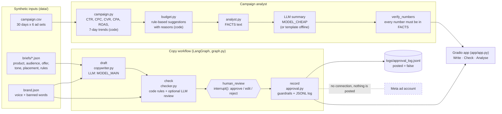

# ads-copy-agent

**Drafts Arabic, English and French ad copy from a product brief, checks it against brand and ad-policy rules, and turns a campaign file into budget suggestions with reasons. A human approves everything, and nothing is ever posted.**

Built for a fictional skincare shop, "Lumi Skin", with synthetic data only. There's no connection to Meta or any ad account.

## Demo

Demo video/Space: pending — to be recorded by Sara.

The Gradio app has three tabs:

- **Write**: pick a brief, draft and check the variants, then approve, edit or reject each one.
- **Check**: paste any ad text and see pass or fail with reasons.
- **Analyse**: metrics, trends, budget suggestions, a chart and a summary whose numbers are checked.


## The problem

A small marketing team running Facebook and Instagram ads in the UAE has to:

- write the same message well in three languages;
- keep it inside the platform's advertising standards and the brand's own rules (no "cures acne", no "Are you struggling with acne?", no whitening language, terms lines on offers);
- decide every week where the budget should go.

An LLM can draft fast, but it can also invent claims and numbers. This project shows a way to get the speed and still keep the checks: the LLM writes and explains, code checks and computes, and a person decides.

## What it does

- **Copy generator.** Writes 3 variants per language (primary text, headline and a call-to-action button) from a JSON brief. The prompt includes the brand voice, the length limits for the placement, the banned words and the required lines.
- **Policy and brand checker.**
  - Layer 1 is code rules in EN, AR and FR: personal attributes, medical claims, unrealistic or guaranteed results, before/after, brand-banned words, missing terms lines or product disclaimers, length per placement, and the CTA type. Style issues are warnings.
  - Layer 2 is an optional LLM review against a written [checklist](docs/policy_checklist.md).
  - Both layers give pass or fail with reasons.
- **Human approval (LangGraph `interrupt`).** The workflow pauses for a person to approve, edit or reject each variant.
  - A variant that fails can't be approved, and edits are checked again.
  - Every decision is logged with `posted: false`.
- **Campaign analyst.** pandas computes CTR, CPC, CVR, CPA and ROAS, plus the last 7 days against the 7 before. Rule-based budget suggestions (SCALE, KEEP, CUT, PAUSE, HOLD) come with their reasons and assumptions, and flag small samples.
- **LLM summary with a number check.** The model only sees the computed FACTS, and every number in its summary is checked against them. Without a key, a template summary is used.
- **Evaluation runner.** One command per evaluation, a `--dry-run` mode, and cost and latency traces for every model call.

## Architecture



**Tools:**

- Python 3.11+, pandas, matplotlib, LangGraph (state, `interrupt`, checkpointer), Gradio, pytest and ruff.
- Models are reached through OpenRouter with the OpenAI-compatible SDK. Model IDs come from `.env`: `MODEL_MAIN`, `MODEL_CHEAP` and `MODEL_JUDGE`.

Component details are in [docs/architecture.md](docs/architecture.md).

## Results

| Run (date, version) | What was measured (denominator) | Result | Evidence | Notes |
|---|---|---|---|---|
| 2026-10-08, v0.1, no LLM | **Policy checker, code rules only, held-out test set**: 48 ad texts (16 EN, 16 AR, 16 FR; 24 violating, 24 compliant) | **Precision 0.94 (16/17), recall 0.67 (16/24)**, accuracy 0.81 (39/48) | `evals/results/policy_rules_summary.json`, `policy_rules_test.csv` | Command: `python -m evals.run --task policy`. Deterministic, no model involved. Rule-file hashes are stored in the summary |
| same | Held-out, by language | EN: P 0.83 (5/6), R 0.63 (5/8) · AR: P 1.00 (6/6), R 0.75 (6/8) · FR: P 1.00 (5/5), R 0.63 (5/8) | same | 16 cases per language, so each case moves recall by 12.5 points |
| same | Development set: 24 texts written together with the rules | 24/24 correct | `policy_rules_dev.csv` | Not evidence of quality: the rules were tuned on this set |
| pending | Checker with the LLM review layer (rules OR LLM), same 48 held-out cases | pending live run (needs OpenRouter key) | — | `python -m evals.run --task policy-llm --model cheap` |
| pending | Copy quality: 30 briefs × 9 variants. Rule pass rate, LLM-judge brand fit and language quality (1–5), and Sara's own 1–5 ratings | pending live run (needs OpenRouter key) | — | `python -m evals.run --task copy --model main`. The output CSV is also Sara's rating sheet |
| pending | Analyst: numbers in the LLM summary that match the computed facts, over 5 scenarios | pending live run (needs OpenRouter key) | — | Target 100%. `python -m evals.run --task analyst --model cheap` |

All labelled cases and the checklist were written by a coding agent. The Arabic and French labels still need review by a native speaker: Sara, who is trilingual.

**Example output of the analyst** (deterministic, on the synthetic `campaign.csv`; this is a demo output, not an evaluation):

| Ad set | ROAS | Purchases | Suggestion | Main reason |
|---|---|---|---|---|
| vitc-ar-stories | 5.01 | 233 | SCALE +20% | At or above target 2.5 overall and in the last 7 days |
| nightcream-fr-retarget | 4.08 | 92 | KEEP | CTR fell 36.46% week on week (likely ad fatigue), so refresh the creative first |
| vitc-en-igfeed | 3.12 | 122 | SCALE +20% | Last 7 days 2.53, still at or above target |
| eyepatch-en-reels-test | 2.24 | 9 | HOLD | Only 9 purchases, so the ROAS isn't reliable yet |
| cleanser-ar-fbfeed-lal | 1.11 | 87 | CUT −30% | Below break-even ROAS 1.54 (assumed 65% gross margin) |
| spf-en-fbfeed-broad | 0.64 | 69 | PAUSE | Below 1.0, so it brings back less than it spends |

## What failed and what I changed

**Held-out errors of the code rules (v0.1)**: 9 of 48 cases, all listed in `evals/results/policy_rules_test.csv`.

- **Sensational hooks are missed: 3 cases**, one per language. Example: "Dermatologists don't want you to know this one trick…". No code rule exists for this category. This was a deliberate choice, and it's what the LLM layer is for.
- **Age-reversal and time-span claims are missed: 3 cases**, one per language. Example: "Look 10 years younger in just two weeks". The patterns cover "overnight" and "in 3 days", but not weeks or "younger".
- **A negative self-image with no condition word is missed: 1 case.** "Feeling self-conscious about your skin?" The personal-attribute rule only looks for listed conditions such as acne or wrinkles.
- **A word form is missed: 1 case.** «crème blanchissante». The banned list has «blanchissant», but word-boundary matching misses the feminine form.
- **One false positive.** "This oil-free gel won't clog your pores or cause breakouts." The rule saw "your … breakouts" and flagged a personal attribute, but the sentence describes the product.

The rules were **not** changed after this run, so the number stays honest. The fixes are listed under Next steps, and they need a fresh held-out set to measure.

**Decisions made while building, on the development set, before the held-out run:**

- A bare percentage is no longer treated as an offer, because skincare copy often names ingredient strengths ("vitamin C 15%"). Only discount wording counts.
- The product name is removed before the claim rules run, so "Salicylic Acne Cleanser" isn't read as a claim about acne.
- "Satisfaction guaranteed" is allowed, because it's about refunds, while "guaranteed" results are not.
- The checklist examples were first copied from the test cases. They were rewritten so the LLM reviewer never sees test sentences in its prompt.

> TODO (Sara): list what you changed after reviewing, for example labels you disagreed with in Arabic or French, rules you rewrote, or prompt changes after the first live run.

## How to run

You need [uv](https://docs.astral.sh/uv/) and Python 3.11 or newer.

```bash
git clone <repo-url> ads-copy-agent && cd ads-copy-agent   # repo name pending Sara's confirmation
uv sync --extra app --extra dev                             # creates .venv and installs everything
uv run pytest -q                                            # offline tests (no network, no keys)
uv run python -m evals.run --task policy                    # checker evaluation (no LLM needed)
uv run python app/app.py                                    # demo at http://127.0.0.1:7860
```

**Live LLM runs** need these settings in `Portfolio Projects/.env` (or `repo/.env`): `OPENROUTER_API_KEY`, `MODEL_MAIN`, `MODEL_CHEAP` and `MODEL_JUDGE`. The judge must come from a different model family. Then run `uv run python -m evals.run --model cheap --limit 10`.

Without a key, `--dry-run` runs the whole pipeline with a fake model and writes to `evals/dry_run/`. These are not results.

## Data and licence

All data is synthetic. See [data/README.md](data/README.md).

- `products.csv` is the shared synthetic Lumi Skin data, generated by `generate.py` (seed 42).
- The briefs and `campaign.csv` are generated by the scripts in `data/`.
- No real company, customer or ad-account data is used.
- The policy checklist paraphrases themes from [Meta's Advertising Standards](https://transparency.meta.com/policies/ad-standards/) in general terms. It's a **simplified demo**, not Meta's review system and not legal advice.

Code and data are under the MIT licence, © 2026 Sara Hebbadj.

## How I used AI agents

> DRAFT for Sara to edit. Keep only what is true.

- **Brief and acceptance tests.** I wrote the brief and the acceptance tests in `BUILD_SPEC.md`. The brief covers the three components, the human approval step, the evaluation sets and the "nothing is posted" rule. It builds on my Meta Business Suite work in skincare e-commerce.
- **First version.** A coding agent (Claude) generated the first version of the code, the synthetic data, the labelled test cases and these docs, following those specs.
  - The development and held-out cases were kept separate, and the rules were frozen before the held-out run.
  - The agent ran the deterministic evaluation and the tests. No LLM was called, because model access wasn't available at build time.
- **My review.** I'll review, run and change the code.

> TODO (Sara): describe your review: which files you read line by line, what you ran, which Arabic and French labels you corrected, and what you changed and why.
>
> TODO (Sara): after the first live run, add the model IDs, date, cost and what surprised you.

## Limitations and next steps

**Limitations:**

- The rules are a small, simplified demo. They can't keep up with the real advertising standards, which change, or with every way people phrase a claim.
- 48 held-out cases is a small set. One case moves the per-language recall by 12.5 points.
- The labels and the rules were written by the same agent, and native-speaker review is pending.
- Arabic matching works inside words, so it can over-match (for example, «رخيص» also matches inside «ترخيص»). Lengths count diacritics.
- Budget thresholds (margin, target ROAS, 30-purchase minimum, 20% steps) are assumptions. ROAS here is last-click revenue from a synthetic file, with no attribution windows or incrementality.
- The number check confirms that a number exists in the facts. It can't confirm the number is attached to the right metric.

**Next steps:**

1. Run the live evaluations, record the model IDs, cost and results, and have Sara rate the drafts.
2. Fix the held-out misses: time spans in weeks and "younger" claims, word-form matching for banned words, and the "won't cause breakouts" false positive. Then write a **new** held-out set to measure the change.
3. Add a native-speaker review of the Arabic and French cases, with label disagreements recorded.
4. Deploy the Gradio app to a Hugging Face Space, after Sara approves.
