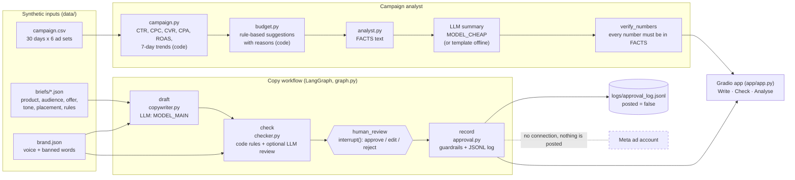

# Architecture

## Components

| File | Job | LLM? |
|---|---|---|
| `src/ads_agent/llm.py` | The only module that calls a model (OpenRouter through the OpenAI SDK). `FakeLLM` is used for tests and dry runs. Every call is traced. | Yes |
| `src/ads_agent/briefs.py` | Loads and validates the briefs | No |
| `src/ads_agent/copywriter.py` | Builds the prompt (brief, voice, limits, banned words, required lines) and parses the JSON variants | Yes |
| `src/ads_agent/policy_rules.py` | Rule data: length limits, condition words, claim patterns, offer and terms patterns | No |
| `src/ads_agent/checker.py` | Applies the rules (fail or warn) and, optionally, an LLM review against `docs/policy_checklist.md` | Optional |
| `src/ads_agent/approval.py` | Applies decisions: a failing variant can't be approved, and edits are re-checked. Writes the log. | No |
| `src/ads_agent/graph.py` | LangGraph workflow: draft → check → interrupt for human review → record | Through the copywriter |
| `src/ads_agent/campaign.py` | Metrics and 7-day trends with pandas | No |
| `src/ads_agent/budget.py` | Budget rules: HOLD, PAUSE, CUT, KEEP or SCALE, with reasons and stated assumptions | No |
| `src/ads_agent/analyst.py` | FACTS text, LLM or template summary, and the number check | Optional |
| `src/ads_agent/charts.py` | Small-multiples ROAS chart (matplotlib) | No |
| `app/app.py` | Gradio demo with three tabs | Optional |
| `evals/run.py` | All evaluations, plus `--dry-run` | Depends on the task |

## Design decisions

- **Code computes and the LLM explains.** Metrics and budget rules are deterministic, so they can be tested and repeated. The LLM gets only the FACTS text, and its summary is checked number by number.
- **Prompt rules plus checker rules.** The prompt asks the model to follow the rules. The checker verifies the result, because a model can ignore instructions.
- **Two checker layers.** Code rules are cheap, explainable and exact for length, banned words and terms lines. The LLM layer is for meaning that patterns miss. The held-out evaluation shows where those gaps are.
- **Human approval is enforced in code.** A variant that fails the checker can't be approved, and an edited variant is checked again. The log records `posted: false` because there is no ad-account connection at all.
- **Arabic text handling.** The checker removes diacritics, unifies the alef forms and matches inside words, because Arabic attaches prefixes such as و and ب to the next word. Lengths are counted in Python characters, so diacritics add to the count.
